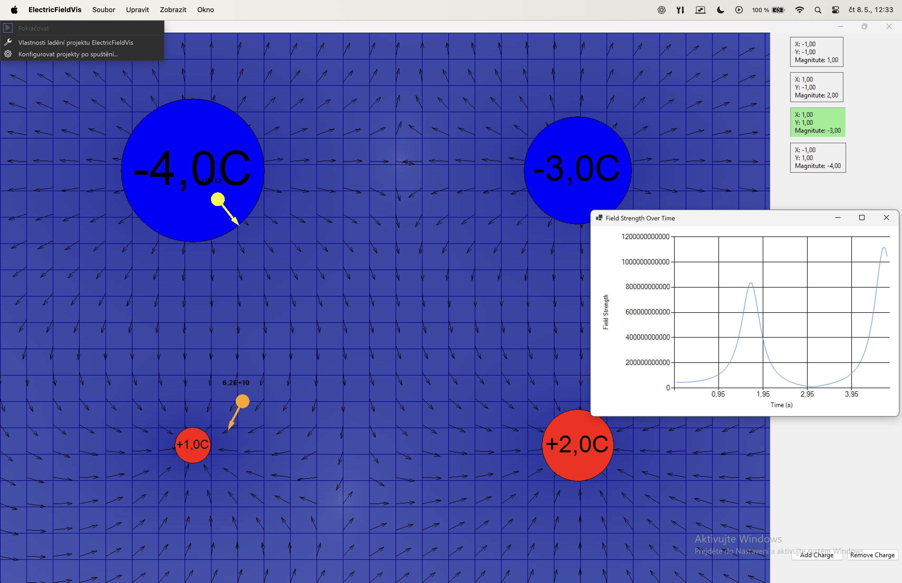
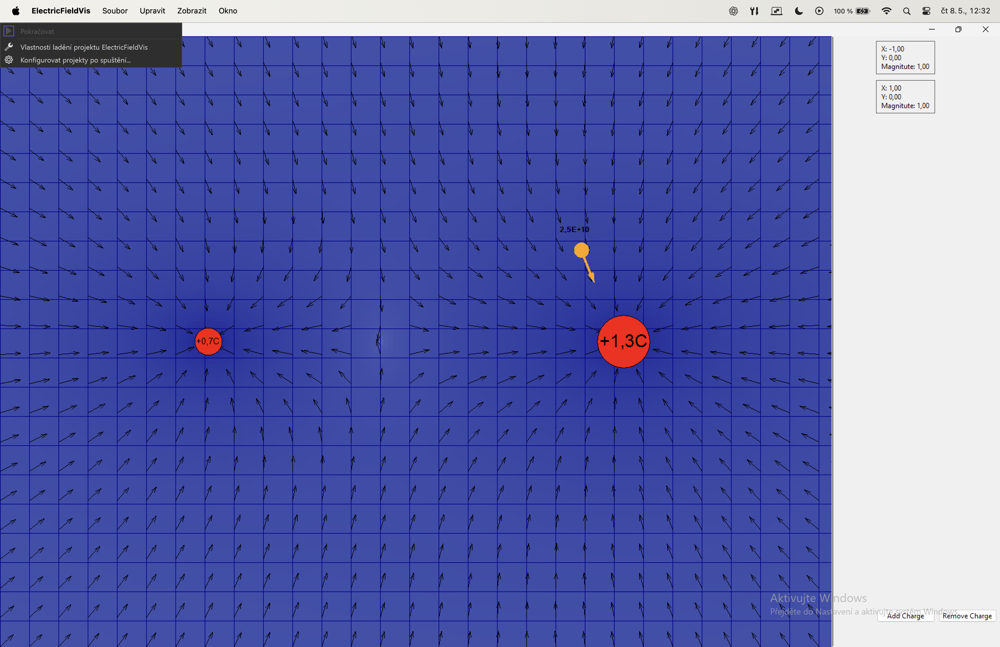
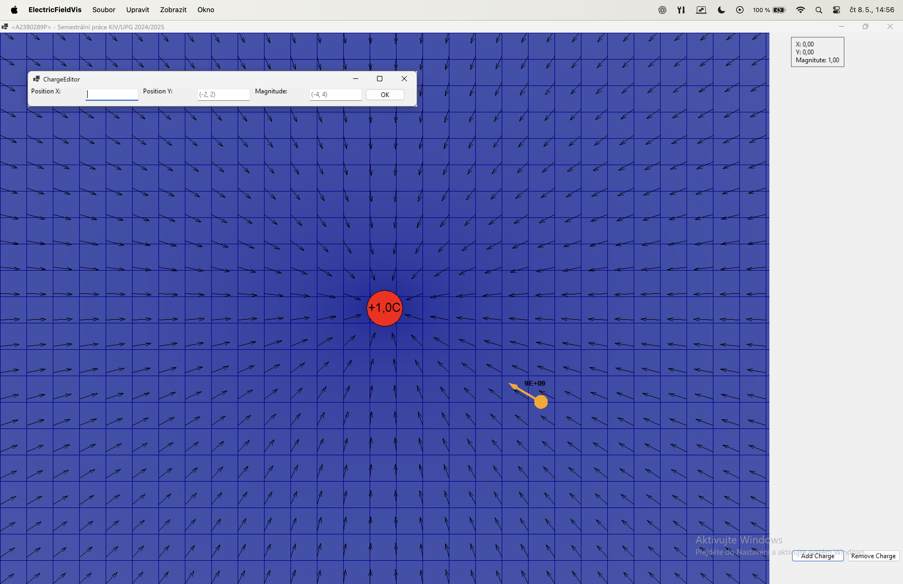

# ElectricFieldVis

**Semestrální projekt KIV/APG 2024/2025**  
Aplikace vizualizuje elektrostatické pole s možností přidávání nábojů, sond a sledování intenzity pole v čase. Projekt obsahuje vícero scénářů, včetně simulace dynamicky se měnících nábojů.

---

## 📁 Struktura projektu

```
├── src/           # Zdrojové kódy (.cs, .csproj, .sln)
├── bin/           # Build výstupy (.exe, .dll, atd.)
├── doc/           # Dokumentace (PDF)
├── Build.cmd      # Skript pro sestavení projektu
├── Run.cmd        # Skript pro spuštění aplikace
├── screenshots/   # Ukázkové obrázky
├── README.md
├── .gitignore
└── LICENSE
```

---

## 🔍 Funkce

- Vizualizace elektrostatického pole pomocí vektorového pole
- Přidávání a editace kladných i záporných bodových nábojů
- Sondy zobrazující intenzitu pole v místě a čase (graf)
- Interaktivní scénáře – např. dva náboje s periodicky se měnící hodnotou
- Ukládání a načítání scén

---

## 🛠 Technologie

- C# (.NET Framework 4.7.2)
- Windows Forms (WinForms)
- System.Drawing, Charting

---

## ▶️ Spuštění

### 🧱 Build
```bash
Build.cmd
```

### 🧪 Spuštění
```bash
Run.cmd
```

Nebo otevři `src/ElectricFieldVis.sln` ve Visual Studiu a spusť `F5`.

---

## 📸 Ukázky

| Sondy a grafy | Dynamické změny | Editor nábojů|
|---------------|----------------|------------------|
|  |  |  | 

---

## 📄 Dokumentace

Více informací v `doc/upg_dog.pdf`.

---

## 📄 Licence

Projekt je licencován pod MIT licencí – viz soubor [LICENSE](LICENSE).
